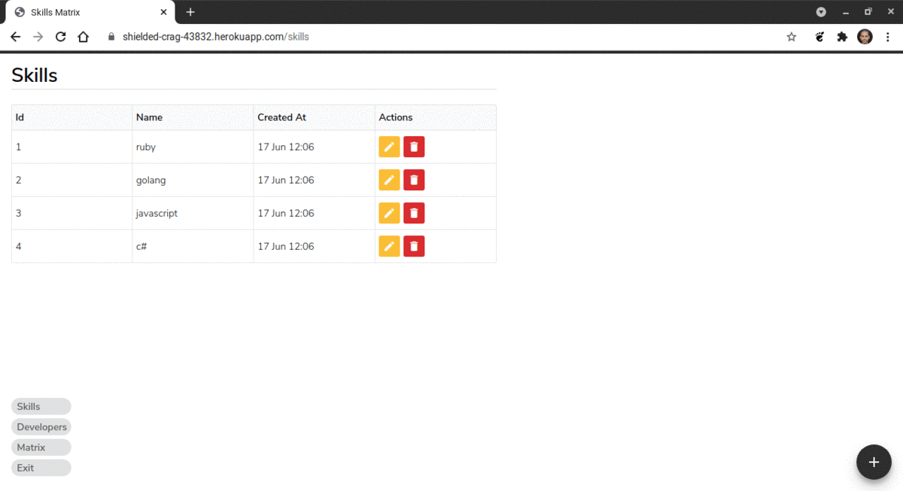

<h1 align="center">
  Skills Matrix
</h1>

<p align="center">
  <a href="#rocket-project">Project</a>&nbsp;&nbsp;&nbsp;|&nbsp;&nbsp;&nbsp;
  <a href="#computer-techs">Techs</a>&nbsp;&nbsp;&nbsp;|&nbsp;&nbsp;&nbsp;
  <a href="#thinking-how-to-use">How to use</a>&nbsp;&nbsp;&nbsp;|&nbsp;&nbsp;&nbsp;
  <a href="#memo-license">License</a>
</p>

## :rocket: Project

:chart_with_upwards_trend: Skills Matrix is a tool to map required skills for a team

### Preview

<p align="center">

</p>

### User Stories

[x] As a user I can sign in

[x] As a user I can create a skill

[x] As a user I can list my skills

[x] As a user I can see a skill

[x] As a user I can update a skill

[x] As a user I can destroy a skill

[x] As a user I can list the developers

[x] As a user I can see a developer

[x] As a user I can destroy a developer

[x] As a user I can see the skill matrix of all developers

[x] As a developer I can inform my skill points

## :computer: Techs

- Ruby
- Ruby on Rails
- SQLite3
- Postgresql

## :thinking: How to use

```sh
git clone git@github.com:flaviogf/skills_matrix.git

docker-compose up -d

docker-compose exec web rails db:prepare

docker-compose exec web rails db:seed

# It's running at http://localhost:3000
```

## :memo: License

This project contains the MIT license. See the file [LICENSE](LICENSE).
